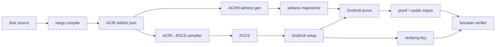
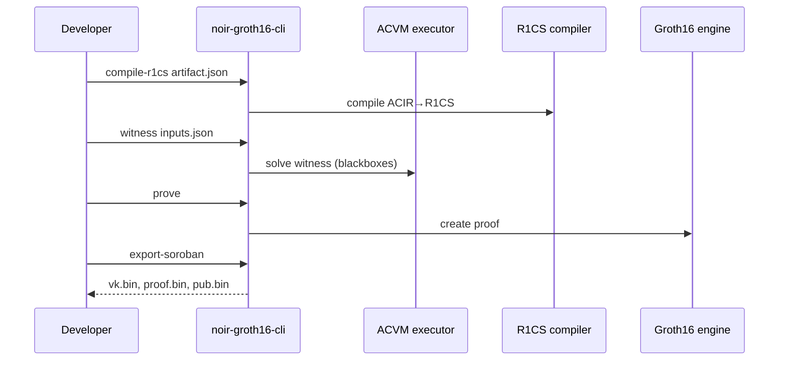

# Technical Specification: Noir → R1CS → Groth16 Backend (BN254, Stellar/Soroban)

## Goals
- Compile Noir artifacts (ACIR) into an R1CS constraint system compatible with Groth16 over BN254.
- Generate witness values from inputs (Noir ABI → witness map → witness vector).
- Produce Groth16 proving key + verifying key + proofs.
- Support two output pathways:
  - Rust-native Groth16 (arkworks or bellman): (pk/vk/proof/public inputs) + Soroban-ready encodings.
  - Interop: emit `.r1cs` + `.wtns` (iden3 formats) so snarkjs can run setup/prove/verify.

## Success criteria
- For a suite of sample Noir circuits, backend produces proofs that verify:
  - off-chain: local verifier (Rust)
  - on-chain: Soroban verifier contract using BN254 host functions (when available)
- Output `.r1cs/.wtns` accepted by snarkjs commands on BN254 (`bn128` in snarkjs terminology).
- Deterministic builds: identical inputs produce byte-identical `.r1cs`, verifying key, and (for fixed randomness) stable serialization.

## Constraints
- Soroban per-transaction limits: 100M CPU instructions, 40MB RAM, tx size 132KB.
- BN254 curve: accept reduced security margin (per CAP-0074).
- Proof encoding for Soroban: uncompressed points (G1=64 bytes, G2=128 bytes; big-endian coords).

## Inputs and outputs
### Inputs
- ACIR program artifact: `<name>.json` (from `nargo compile`) containing bytecode + ABI.
- Prover inputs: TOML/JSON matching Noir ABI.

### Outputs (Rust-native)
- `circuit.r1cs.json` (debug): human-readable constraints (for tests).
- `proving_key.bin` / `verifying_key.bin` (canonical binary encodings).
- `proof.bin` and `public_inputs.bin` (Soroban-ready, uncompressed points + Fr scalars).
- `vk.json` / `proof.json` (developer-friendly, optional).

### Outputs (snarkjs interop)
- `circuit.r1cs` (iden3 binary format)
- `witness.wtns` (snarkjs-compatible)
- Optional helper: `public.json` in snarkjs style (public signals)

## Supported language and opcode subset (MVP)
- Arithmetic constraints (`AssertZero(Expression)`): full support
- Blackbox:
  - RANGE: supported (bit decomposition)
  - Poseidon2Permutation: supported (expanded to constraints)
  - AND/XOR: supported if RANGE exists (bitwise via bits)
- BrilligCall/Directive: do not emit constraints; allow witness-only execution (warn on underconstraint).
- Call, MemoryInit, MemoryOp: unsupported initially.

## ACIR → R1CS mapping

### Background: Expression form
Expression represents a quadratic polynomial:
- mul_terms: Σ (q_m * w_a * w_b)
- linear_combinations: Σ (q_l * w)
- q_c: constant

### AssertZero(Expression) template (canonical)
For each mul term `(q, a, b)`:
1. allocate intermediate witness `t`
2. constraint: `a * b = t`
3. add `q * t` into a linear accumulator

Then one linear constraint:
- Let `L = Σ(q·t) + Σ(q_l·w) + q_c`
- enforce `1 * L = 0` (R1CS linear constraint)

### RANGE(x, nbits) template
- Allocate bits b[0..nbits-1]
- Boolean constraints: `b_i * (b_i - 1) = 0`
- Recomposition: `x = Σ (2^i * b_i)`

### Poseidon2Permutation(state[4]) template
- Use Noir’s BN254 poseidon2 constants and round function.
- Expand:
  - external layer (4x4 matrix mul)
  - rounds: add round constants, S-box (x^5), matrix mul
  - partial rounds: S-box only on state[0], internal M multiplication
- Emit constraints for each multiplication/power:
  - x^2 via `x*x = x2`
  - x^4 via `x2*x2 = x4`
  - x^5 via `x4*x = x5`

## Witness generation approach
- Parse Noir ABI from artifact.
- Encode inputs into ACVM initial witness map.
- Execute ACVM partial witness generation with a BN254 blackbox solver:
  - Poseidon2Permutation uses Noir’s `bn254_blackbox_solver`.
- Convert witness map to witness vector in canonical wire order:
  - wire 0 = 1
  - then public outputs/inputs (configurable)
  - then private witnesses

## Backend choice
Primary (recommended):
- Rust: arkworks (`ark-groth16`) for Groth16 over `ark-bn254`.
Optional:
- Rust: bellman Groth16 (ecosystem widely used, Zcash lineage).
Interop:
- Emit `.r1cs/.wtns` and use snarkjs for ceremony + proving, if desired.

## Trusted setup workflow
Two options:
- Local dev: `generate_random_parameters` (Rust) for rapid iteration.
- Production: snarkjs Powers of Tau + Phase 2:
  - `snarkjs powersoftau ...`
  - `snarkjs groth16 setup circuit.r1cs pot_final.ptau circuit.zkey`
  - export `verification_key.json`
  - prove with `.wtns`

## Repo layout
- `crates/noir-acir/`      : parse artifacts, ABI, ACIR program model
- `crates/noir-witness/`   : ACVM execution + blackbox solver bindings
- `crates/noir-r1cs/`      : ACIR→R1CS compiler (matrices + writers)
- `crates/noir-groth16/`   : Groth16 keygen/prove/verify + serialization
- `crates/noir-cli/`       : CLI (`compile-r1cs`, `witness`, `setup`, `prove`, `verify`, `export-soroban`)
- `contracts/soroban/`     : verifier contract (feature-gated; depends on BN254 host funcs)
- `test-vectors/`          : sample Noir circuits + known-good proofs

## Public API (Rust) sketch
- `parse_noir_artifact(bytes) -> NoirArtifact`
- `generate_witness(artifact, inputs) -> WitnessMap`
- `compile_r1cs(acir_program, options) -> R1csSystem`
- `write_r1cs_iden3(r1cs, path)`
- `write_wtns_snarkjs(witness, path)`
- `groth16_setup(r1cs) -> (pk, vk)`
- `groth16_prove(pk, witness) -> Proof`
- `groth16_verify(vk, public_inputs, proof) -> bool`
- `export_soroban(vk, proof, public_inputs) -> (vk_bytes, proof_bytes, inputs_bytes)`

## Minimal prototype pseudocode (Rust)
```rust
fn pipeline(artifact_json: &[u8], inputs_json: &[u8]) -> Result<(), Error> {
    let artifact = parse_noir_artifact(artifact_json)?;
    let wit_map = generate_witness(&artifact, inputs_json)?;
    let r1cs = compile_r1cs(&artifact.acir_program, CompileOptions::mvp())?;

    // Interop outputs
    write_r1cs_iden3(&r1cs, "circuit.r1cs")?;
    write_wtns_snarkjs(&r1cs, &wit_map, "witness.wtns")?;

    // Native Groth16
    let (pk, vk) = groth16_setup(&r1cs)?;
    let proof = groth16_prove(&pk, &r1cs, &wit_map)?;
    let public_inputs = r1cs.public_inputs(&wit_map)?;
    assert!(groth16_verify(&vk, &public_inputs, &proof)?);

    // Soroban export
    let soroban = export_soroban(&vk, &proof, &public_inputs)?;
    std::fs::write("vk.bin", soroban.vk)?;
    std::fs::write("proof.bin", soroban.proof)?;
    std::fs::write("pub.bin", soroban.public_inputs)?;
    Ok(())
}
```

## Mermaid diagrams




## Primary sources (links)
- Noir repo: https://github.com/noir-lang/noir
- Nargo commands docs: https://noir-lang.org/docs/reference/nargo_commands
- ACIR opcode docs.rs: https://docs.rs/acir/latest/acir/circuit/opcodes/enum.Opcode.html
- ACIR Expression struct: https://raw.githubusercontent.com/noir-lang/noir/master/acvm-repo/acir/src/native_types/expression/mod.rs
- ACVM / ACIR repo: https://github.com/noir-lang/acvm
- Pluto/edge noir.rs (ACIR→R1CS example): https://raw.githubusercontent.com/pluto/edge/main/frontend/src/noir.rs
- Lambdaclass acir_to_r1cs.rs: https://raw.githubusercontent.com/lambdaclass/noir_backend_using_gnark/integration/src/gnark_backend_wrapper/groth16/acir_to_r1cs.rs
- Noir BN254 Poseidon2 blackbox solver: https://raw.githubusercontent.com/noir-lang/noir/master/acvm-repo/bn254_blackbox_solver/src/poseidon2.rs
- snarkjs: https://github.com/iden3/snarkjs
- iden3 r1cs binary format spec: https://raw.githubusercontent.com/iden3/r1csfile/master/doc/r1cs_bin_format.md
- wtns-file crate docs: https://docs.rs/wtns-file
- ark-groth16 docs: https://docs.rs/ark-groth16/latest/ark_groth16/
- bellman groth16 docs: https://docs.rs/bellman/latest/bellman/groth16/
- gnark docs (schemes/curves): https://docs.gnark.consensys.io/Concepts/schemes_curves
- gnark Keccakf gadget cost: https://pkg.go.dev/github.com/consensys/gnark/std/permutation/keccakf
- Stellar/Soroban resource limits: https://developers.stellar.org/docs/networks/resource-limits-fees
- CAP-0074 BN254 host functions: https://raw.githubusercontent.com/stellar/stellar-protocol/master/core/cap-0074.md